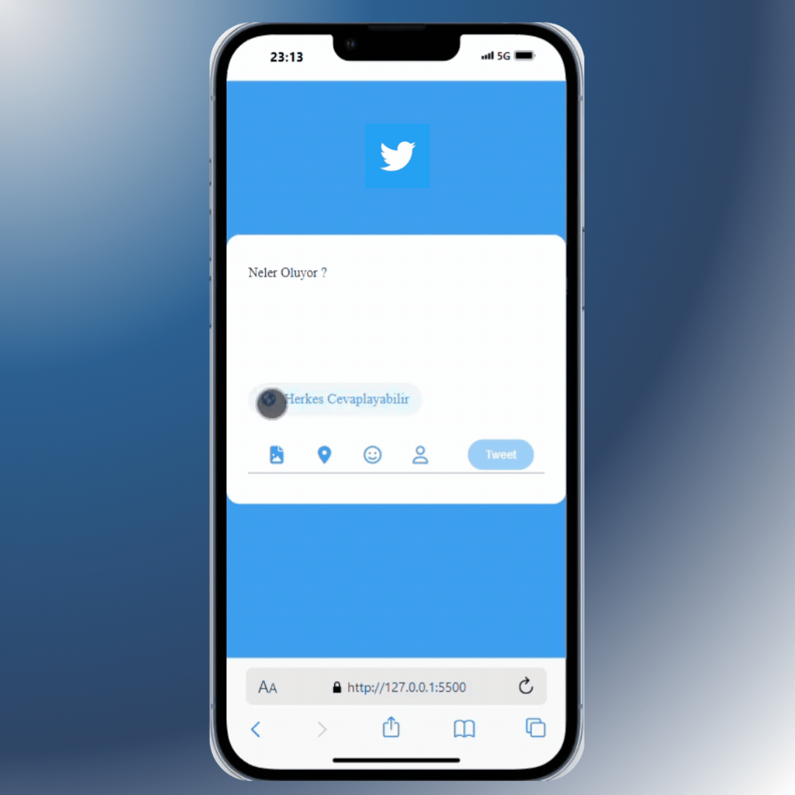

# 🐦 Tweeter Uygulaması Tweet Oluşturma Kartı

Bu projede, bir tweet oluşturma kartı arayüzü oluşturmak için HTML, CSS ve JavaScript kullanıldı. 
Kullanıcılar, tweetlerini yazabilir ve karakter sınırını gözeterek göndermek için bir kullanıcı arayüzü sunar.

## 💼 Sunum

## 📚 Özellikler

- **🖊️ Tweet Girişi: Kullanıcılar tweetlerini yazabilir.
- **🔄 Karakter Sınırı: 140 karakter sınırı vardır ve karakter sayacı ile takip edilmesini sağlar.
- **🌍 Gizlilik Ayarları: Basit gizlilik ayar simgeleri (örneğin, dünya ikonu).
- **🎈 Emoji ve İkonlar: Font Awesome entegrasyonu ile ikonlar ve emoji desteği.

## 📝 Yapılanlar

- **🎨 Kullanıcı input'a tıkladığında placeholder'ın renginin değişmesi
- **✨ Klavyeden giriş olduğunda placeholder'ın kaybolması
- **🔄 Klavyeden giriş yapılmadığında placeholder'ın tekrar gelmesi
- **✅ Eğer klavye girişi varsa Tweet butonunun aktif olması
- **🚫 Eğer kullanıcı limiti geçmişse Tweet butonunun pasif olması
- 

### 🔧 Kullanılan Teknolojiler

- **🎨 CSS ve HTML
- **🧠 JavaScript

  
